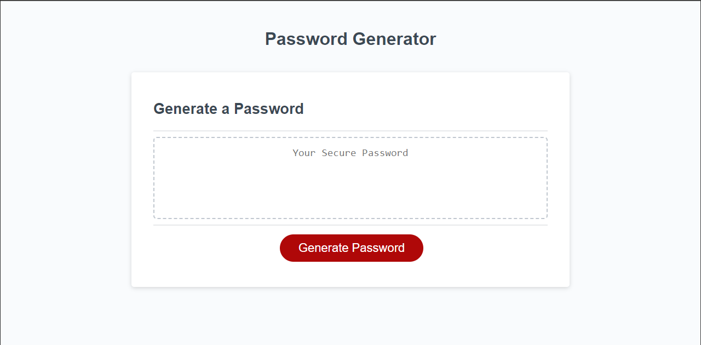
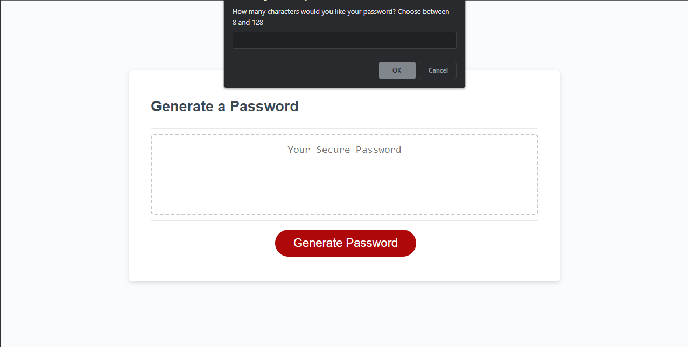
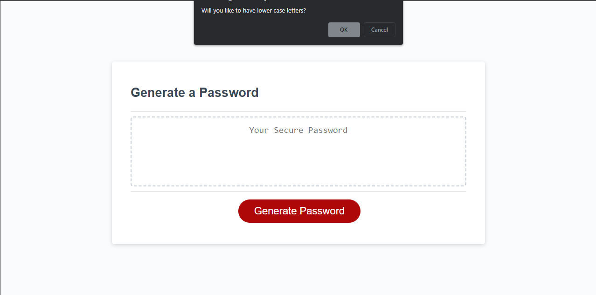
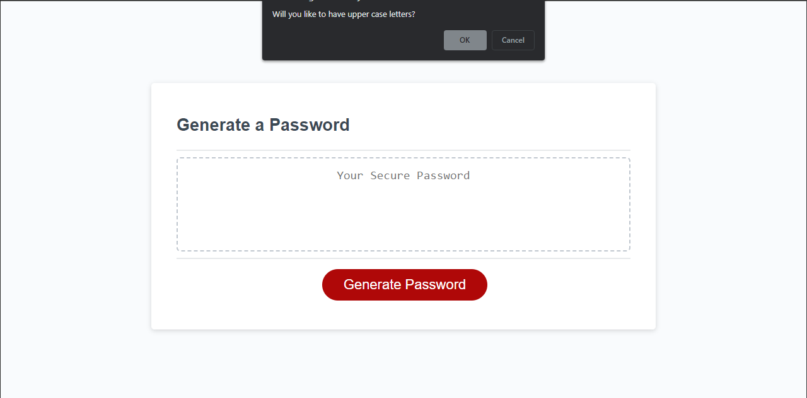
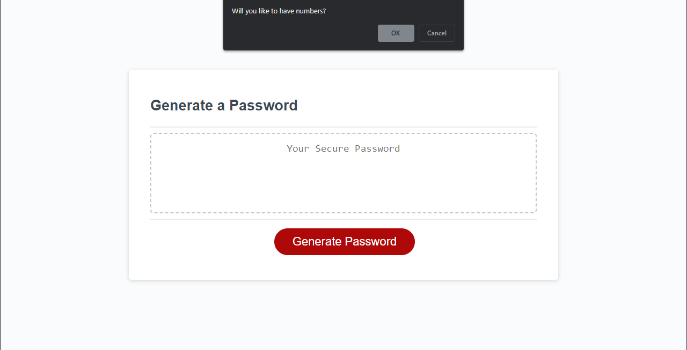
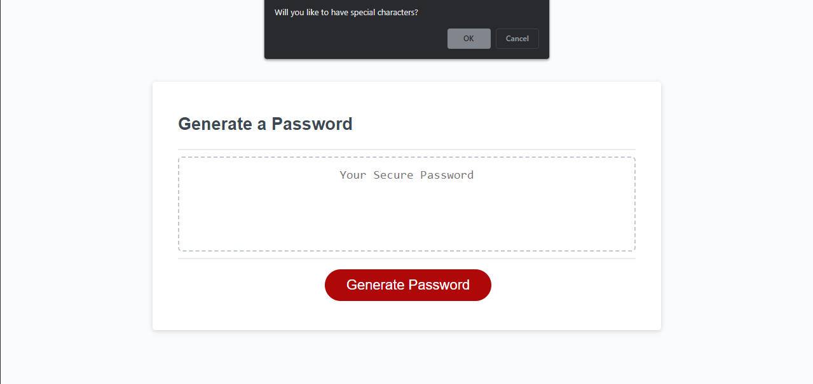
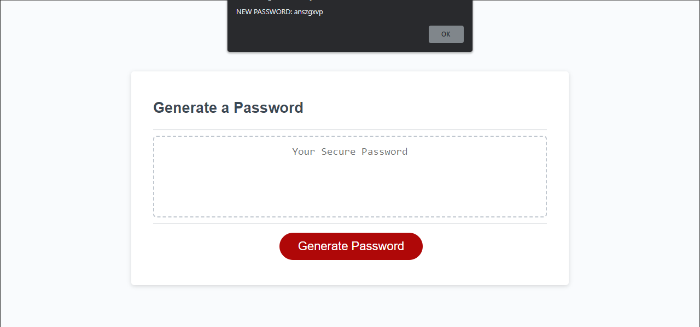
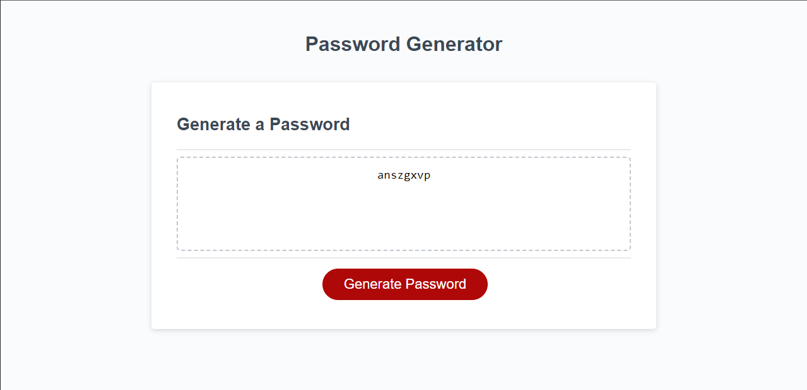

# PASSWORD Generator by C. Osuna

## Features:

1. Gets what the user would like the password to have and generates a password based on that.
2. Prints and creates an alert for the new password on the website for the user to see.
3. Password can have numbers, lower and upper case letters and also special characters.

## How does it work?

    User have to answer the prompts of the website in order for it to work. If the required input is
    not provided then the user will be asked again in order to continiue but if he does not, the program will terminate.

    If the user answers all the questions the right way then he will get a custom result based on the prompts answered. 

    0. Length between 8 and 128 charcacters.
    1. Does it have upperCase letters.
    2. Does it have lowerCase letters.
    3. Does it have numbers.
    4. Does it have special characters.

    Depending on what the user responds yes to, then the password will include those inside of the password.

# SCREENSHOTS

## GitHub Deployed page and GitHub Repo:

REPO : [https://github.com/OkamiXX/03-Password-Generator-JavaScript](https://github.com/OkamiXX/03-Password-Generator-JavaScript)

Deployed Website : [https://okamixx.github.io/03-Password-Generator-JavaScript/](https://okamixx.github.io/03-Password-Generator-JavaScript/)
